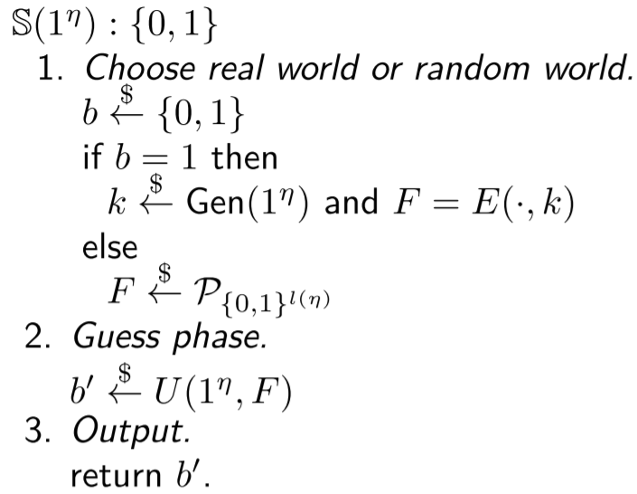

\tableofcontents
\newpage

# Symmetric encryption

**Kerkhoffs Principle**: The security of a system should only depend on whether the actual key is secret, not on the system itself. The whole system is assumed to be public. No "Security by obscurity".

## Scenario 1

**One message with constant length**

### Cryptosystems

A cryptosystem is a tuple $\mathcal{S} = (X, K, Y, e, d)$ with

- X: set of plaintexts
- K: finite set of keys
- Y: set of ciphertexts
- e: encryption function
- d: decryption function

Perfect correctness: \tab\tab $d(e(x, k), k) \quad \forall x \in X, k \in K$

No unnecessary ciphertexts: \tab $Y = \{e(x,k) | x \in X, k \in K\}$ 

### Vernam system

The Vernam cryptosystem of length $l$ is defined as $(\{0, 1\}^l, \{0, 1\}^l, \{0, 1\}^l, e, d)$ where 

$e(x, k) = x \oplus k$ and $d(y, k) = y \oplus k$.

A vernam system of length $l>0$ provides perfect secrecy for every uniform $P_K$. It is the perfect system for Scenario 1.

### Perfect Secrecy

A cryptosystem with key distribution $\mathcal{V} = \mathcal{S}[P_k]$  provides perfect secrecy if for all plaintext distributions $P_X$, the probability of every plaintext remains the same after the ciphertext is seen, i.e.: $$P(x) = P(x | y) \quad \forall x \in X, y \in Y, P(y) > 0$$

**Example Proof**:

We need to show the criteria above for all plaintext distributions $P_X$. Therefore we use variable probabilities for the plaintexts $P_X(a) = p, P_X(b) = 1-p$ (for 2 plaintexts, else $p_1, ..., p_n$).
\begin{minipage}{.35\linewidth}
    \centering
    \includegraphics[width=\linewidth]{img/perfect_secrecy_example}
\end{minipage}
\begin{minipage}{.63\linewidth}
    \begin{align*}
        P(a | A) &= \frac{P(a, A)}{P(A)} &= \frac{\frac{1}{2} * p}{\frac{1}{2} * p + \frac{1}{2} * (1-p)} &= p = P(a)\\
        P(a | B) &= \frac{P(a, B)}{P(B)} &= \frac{\frac{1}{2} * p}{\frac{1}{2} * p + \frac{1}{2} * (1-p)} &= p = P(a)\\
        P(b | A) &= \frac{P(b, A)}{P(A)} &= \frac{\frac{1}{2} * (1-p)}{\frac{1}{2} * (1-p) + \frac{1}{2} * p} &= 1-p = P(b)\\
        P(b | B) &= \frac{P(b, B)}{P(B)} &= \frac{\frac{1}{2} * (1-p)}{\frac{1}{2} * (1-p) + \frac{1}{2} * p} &= 1-p = P(b)
    \end{align*}
\end{minipage}
\newline

**Theorem**: 

Let $\mathcal{S} = (X,K,Y,e,d)$ be a cryptosystem providing perfect secrecy, then it holds $|K| \geq |Y| \geq |X|$.

**Shannons Theorem**:

Let $\mathcal{V} = \mathcal{S}[P_k]$ be a cryptosystem with key distribution $P_K$ and $|K| = |Y| = |X|$. The system provides perfect secrecy if and only if

1. $P_K$ is a uniform distribution
2. $\forall x \in X, y \in Y \exists k \in K \text{ with } e(x, k) = y$ (There must be a key for every plaintext/ciphertext pair)

## Scenario 2 

**Multiple messages with constant length, no repetition**

### Vernam in Scenario 2

Vernam is not a secure cryptosystem anymore, since from 2 ciphertexts, Eve can learn non-trivial information about the plaintexts:
$$y_0 \oplus y_1 = x_0 \oplus k \oplus x_1 \oplus k = x_0 \oplus x_1$$

Also with 1 plaintext-ciphertext pair (CPA), the key can be calculated as $k = x \oplus y$.

### Substitution Cryptosystem

Let $X$ be a non-empty finite set. A substitution cryptosystem over X is a tuple $(X, P_X, X, e, d)$ where $P_X$ is the set of all permutations of $X$.
$$e(x, \pi) = \pi(x) \quad d(y, \pi) = \pi^{-1}(y) \quad \forall x,y \in X, \pi \in P_X$$

Substitution cryptosystems provide "perfect security" in scenario 2, but they are impractical because the substitution table ($\pi$) has a size of $2^l * l$.

### $l$-Block Cipher

Let $l : \mathbb{N} \rightarrow \mathbb{N}$ be a polynomial. An $l$-block cipher $B$ is a cryptosystem of the form 

$\bigg(\{0,1\}^{l(\eta)}_{\eta \in \mathbb{N}},\; Gen(1^\eta),\; \{0,1\}^{l(\eta)}_{\eta \in \mathbb{N}},\; E,\; D \bigg)$ or simplified: $\bigg(\{0,1\}^l,\; Gen(1^\eta),\; \{0,1\}^l,\; E,\; D \bigg)$

### Substitution-Permutation Cryptosystem (SPCS)

**Notation**: 

- plaintexts are split into $m$ words with length $n$ with $l = m*n$, $x^{(i)}$ denotes the $i$'th word
- $[r] = \{0, 1, ..., r-1\}$
- $\beta \in \mathcal{P}_{[l]}$, then $x^\beta(i) = x(\beta(i))$

**General Principle**: Over $r$ rounds, (round) key additions, word substitutions and bit permutations are applied, including an initial step that just applies key addition and shortened last round without bit permutation.

\begin{minipage}{.6\linewidth}
    \includegraphics[width=\linewidth]{img/spcs}
\end{minipage}
\begin{minipage}{.35\linewidth}
    \includegraphics[width=\linewidth]{img/spcs_vis}
\end{minipage}

**Known Attacks**: 

- Brute Force Attack
- Linear Cryptanalysis
- Differential Cryptanalysis

**Linear Cryptanalysis**: 

- Relies on a set $T$ of plaintext-ciphertext pairs
- Instead of brute forcing the whole key, get small parts of the key at a time
- Exploit linear dependencies

**AES (Advanced encryption standard)**: basically SPCS with modifications

### Algorithmic Security of Block Ciphers

\Begin{minipage}{.55\linewidth}

We consider a block cipher secure if it is almost as good as a substitution cryptosystem w.r.t. resource-bound adversaries.
Therefore no adversary $U$ should be able to distinguish BCS and SCS. Formally, we use the BCS for $b=1$ (real world) and the SCS for $b=0$ (random world) in the security game.

The winning probability is $Pr[\mathbb{E}(1^n) = 1]$. Since a random guesser already has a probability of $0.5$, the advantage is normalized.

\End{minipage}\hfill
\Begin{minipage}{.4\linewidth}

\End{minipage}

\begin{align*}
    Adv_{U, B}(\eta) &= 2 * \bigg( Pr[\mathbb{E}_U^B(1^\eta) = 1] - \frac{1}{2} \bigg) \in [-1, 1]
    &suc_{U, B}(\eta) = Pr[\mathbb{S}_U^B\langle b=1\rangle (1^\eta) = 1]\\
    Adv_{U, B}(\eta) &= suc_{U, B}(\eta) - fail_{U, B}(\eta)
    &fail_{U, B}(\eta) = Pr[\mathbb{S}_U^B\langle b=0\rangle (1^\eta) = 1]  
\end{align*}

### PRP/PRF Switching Lemma

Since substitution cryptosystems cannot be distinguished from (secure) $l$-Block cryptosystems, we can see $l$-Block cryptosystems as pseudo-random permutations (PRP). Anyway, for proving purposes, it can be easier to see them as pseudo-random functions. The PRP/PRF Switching Lemma says, that we can use them interchangeably, since the difference of advantages is negligible:

Let $B$ be an $l$-block cipher and $U$ be an $l$-distinguisher with runtime bound $q(\eta)$ where q is a positive polynomial and $\eta \in 	\mathbb{N}$.
Then the following holds true:

$$|Adv^{PRP}_{U,B}(\eta) - Adv^{PRF}_{U,B}(\eta)| \leq \frac{q(\eta)^2}{2^{l(\eta)+1}}$$

## Scenario 3

**Arbitrary messages with any length (possibly with repetition)**

### Symmetric Encryption Scheme

A symmetric encryption scheme is a tuple $S = (Gen(^\eta), E, D)$ with 

- security parameter $\eta$
- ppt key generation algorithm $Gen(1^\eta)$
- ppt encryption algorithm $E(x: \{0, 1\}^*, k: K) : \{0,1\}^*$ 
- dpt decryption algorithm $D(y: \{0,1\}^*, k: K) : \{0,1\}^*$  
- and $D(E(x, k), k) = x$

E cannot be deterministic, because else we wouldn't be able to send the same message multiple times, i.e. the same plaintext encrypted under the same key should result in a different ciphertext (with a high probability).

### Encryption Schemes from Stream Ciphers

**Idea**: Vernam is safe if we use every key just once. So using the key as seed of a random number generator, that generates a stream of random numbers, enables the usage of the vernam system for arbitrarily long messages.

#### Number generator

A number generator (NG) is a dpt algorithm of the Form $G : (s: \{0,1\}^\eta) : \{0,1\}^{p(\eta)}$ where $p$ is the expansion factor.

#### PRNG-Distinguisher

TODO

### Encryption Schemes from Block Ciphers

#### ECB Mode

**Idea**: Split the message in blocks of constant length and encrypt each block under the given key using the underlying block cipher.

\includegraphics[width=\linewidth]{img/ecb-mode}

**Security**: It's not secure, since the ciphertext carries non-trivial information about the plaintext: $\text{for } y = y_0 || y_1\text{, then } y_0 = y_1 \text{ if } x_0 = x_1$.

#### CBC Mode

\Begin{minipage}{.55\linewidth}

**Idea**: Add and initialization vector $v$ that is \texttt{xor}'ed with the plaintext before encrypting. That $v$ is part of the key. 
\newline\newline
**Problem**: Still deterministic, so every plaintext can be sent just once.

\End{minipage}\hfill
\begin{minipage}{.4\linewidth}
    \includegraphics[width=\linewidth]{img/cbc-mode}
\end{minipage}

#### R-CBC Mode

\Begin{minipage}{.55\linewidth}

**Idea**: To solve the issues of CBC-Mode, R-CBC moves the initialization vector $v$ out of the key and generates a random one while decryption. The vector is appended as first block of the ciphertext to enable decryption.
\newline\newline
**Security**: Its secure if the underlying block cipher is secure.

\End{minipage}\hfill
\begin{minipage}{.4\linewidth}
    \includegraphics[width=\linewidth]{img/rcbc-mode}
\end{minipage}

#### R-CTR Mode

\Begin{minipage}{.55\linewidth}

**Idea**: Alternative to R-CBC. Generate a random number $r$ (comparable to $v$ of R-CBC), encrypt this random number under the key and xor it with the plaintext. The counter is increased by 1 for each block. The counter $r$ is appended as first block of $y$ to enable decryption.
\newline\newline
**Security**: Its secure if the underlying block cipher is secure.

\End{minipage}\hfill
\begin{minipage}{.4\linewidth}
    \includegraphics[width=\linewidth]{img/rctr-mode}
\end{minipage}

### CPA-Security

\Begin{minipage}{.62\linewidth}

**CPA**: Chosen-Plaintext-Attack
\newline\newline
**Game**: Adversary $A$ consists of finder $AF$ and guesser $AG$. The finder chooses 2 plaintexts $z_0, z_1$. One of them is encrypted. The guesser has to determine which of them is the corresponding plaintext.
\newline\newline
Advantage, success and failure are defined as for block ciphers.

\End{minipage}\hfill
\begin{minipage}{.35\linewidth}
    \includegraphics[width=\linewidth]{img/cpa}
\end{minipage}

### CCA-Security

\Begin{minipage}{.62\linewidth}

**CCA**: Chosen-Ciphertext-Attack
\newline\newline
**Game**: In addition to the encryption oracle $H$ from the CPA-game, the adversary also gets a decryption oracle $H^{-1}$. 
\newline\newline
Advantage, success and failure are defined as for block ciphers.

\End{minipage}\hfill
\begin{minipage}{.35\linewidth}
    \includegraphics[width=\linewidth]{img/cpa}
\end{minipage}

### Vaudenay's Padding Attack

- TODO

# Number Theory

## Fundamental Theorem of Arithmetic

Every natural number $n \in \mathbb{N}, n \geq 2$ has exactly one combination of prime factors.

$$n = p_1 * \dots * p_k \quad \text{with} k \leq log(n)$$ 

## Modulo

Let $n \in \mathbb{N}\backslash \{0\}, a \in \mathbb{Z}$. Then $\exists !q \in \mathbb{Z}, r \in \{0, \dots, n-1\}$ such that $a = n*q + r$.

$$a \text{ div } n := q  \quad\quad\text{and}\quad\quad a \text{ mod } n := r$$

## $\mathbb{Z}_n$

Let $n \geq 1$. We define the set $\mathbb{Z}_n := \{0, \dots, n-1\}$ of remainders of divisions by $n$. Let $a,b \in \mathbb{Z}_n$, then 

$$a +_n b := (a + b) \text{ mod } n \quad\quad\text{and}\quad\quad a *_n b := (a * b) \text{ mod } n$$

## Group

A tuple $(\mathcal{G}, \cdot)$ is called group if $\mathcal{G}$ is a non-empty set and $\cdot : \mathcal{G} \times \mathcal{G} \rightarrow \mathcal{G}$ is a function such that: 

- $(x \cdot y) \cdot z = x \cdot (y \cdot z) \quad\forall x,y,z \in \mathcal{G}$ \tab\tab (associativity)
- $\exists e \in \mathcal{G} : e \cdot x = x \cdot e = x \quad \forall x \in \mathcal{G}$ \tab\tab (neutral element)
- $\forall x \in \mathcal{G} \exists x^{-1} \in \mathcal{G} : x \cdot x^{-1} = e$ \tab\tab (inverse element)

The *order* of a group is the number of elements in $\mathcal{G}$.

The exponentiation is defined as usual. For a finite group $(\mathcal{G}, \cdot)$ with order $n$ and neutral element $e$, the following holds true:

$$ g^n = e \quad\quad\text{and}\quad\quad g^a = g^{a \text{ mod } n}$$

## Ring

A Ring is the tuple $(\mathcal{R}, +, \cdot)$ if  $(\mathcal{R}, +)$ is an abelian (commutative) group and the function $\cdot : \mathcal{R} \times \mathcal{R} \rightarrow \mathcal{R}$ is associative, distributive and has a neutral element.

The set of invertible elements in $\mathcal{R}$ is denoted by $\mathcal{R}^*$. The tuple $(\mathcal{R}^*, \cdot)$ is an abelian group called group of units.

## Greatest common divisor

We say $a \text{ divides } b$ or $a | b$ if $\exists c \in \mathbb{Z} : b = c \cdot a$. The greatest common divisor is definded as $$gcd(a, b) = max\{c : c | a \text{ and } c | b\} \text{ where } gcd(0,0) := 0$$

The set of invertible elements of $\mathbb{Z}_n$ can be determined by the gcd.
$$\mathbb{Z}_n^* = \{a \in \mathbb{Z}_n | gcd(a, n) = 1\}$$

## Eurler's Totient Function

Let $n \geq 2$. The Euler's totient function is defined by $$\Phi(n) = | \mathbb{Z}_n^* | = (p_0 - 1) + p_0^{\alpha_0 - 1} \dots (p_{r-1} - 1) + p_{r-1}^{\alpha_{r-1} - 1}$$ where $p_1, \dots, p_{r-1}$ are primes and $n = p_0^{\alpha_0 - 1} \cdot \dots \cdot p_{r-1}^{\alpha_{r-1} - 1}$. Let $p$ be a prime, then $\Phi(p) = p - 1$.

## Euclids Algorithm

\begin{minipage}{.3\linewidth}
Algorithm to calculate the gcd. Can be extended to calculate the inverse of an element in $\mathbb{Z}_n^*$.
\end{minipage}\hfill
\begin{minipage}{.65\linewidth}
    \includegraphics[width=\linewidth]{img/euclid}
\end{minipage}

## Fast Exponentiation

\Begin{minipage}{.7\linewidth}

Algorithm to efficiently compute the exponentiation of a group element. Let $\mathcal{G}$ be a group and $g \in \mathcal{G}, m \in \mathbb{N}$. It uses the fact, that $g^{2k} = (g^k)^2$. Instead of doing $2k$ multiplications, we can do $k + 1$. This is applied recursively to minimize the number of exponentiations that need to be computed. To make the algorithm work with any $k$ (not just powers of $2$), we use the binary representation of the exponent, e.g.

$$13 = 2^0 + 2^2 + 2^3 = (1101)_2 \quad \Rightarrow \quad g^{13} = g^{2^0} \cdot g^{2^2} \cdot g^{2^3}$$

To compute $g^m$, the algorithm iterates over the bits of $m$. If the bit is one, multiply the result with the current factor. In any case, square the current factor.

The algorithm has a complexity of $\mathcal{O}(log(m))$.

\End{minipage}\hfill
\begin{minipage}{.25\linewidth}
\includegraphics[width=\linewidth]{img/fast_exp}
\end{minipage}

## Cyclic Groups

A group $\mathcal{G}$ is called cyclic, iff $\exists g \in \mathcal{G}$ such that  $\langle g\rangle = \mathcal{G}$.

If $p = |\mathcal{G}|$ is prime, then $\mathcal{G}$ is a cyclic group.

$\mathbb{Z}_p^*$ is a cyclic group if $p$ is prime.

### Subgroups

Let $(\mathcal{G}, \cdot)$ be a finite group and $U \subseteq \mathcal{G}$. 

**Definition**: The tuple $(U, \cdot)$ is a subgroup of $\mathcal{G}$ iff $U$ is a group.

**Lemma**:  The tuple $(U, \cdot)$ is a subgroup of $\mathcal{G}$ iff $1 \in U$ and $a \cdot b \in U \quad \forall a,b \in U$

**Lagranges Theorem**: If $U$ is a subgroup of $\mathcal{G}$, then it holds true that $|U| | |\mathcal{G}$.

### Generated Groups and Generators

Let $\mathcal{G}$ be a group and $g \in \mathcal{G}$. By $\langle g\rangle$ we denote the smallest subgroup of $\mathcal{G}$ that contains $g$. 
$$\langle g\rangle = \{1, g, g^{-1}, g^{2}, g^{-2}, \dots\}\quad
\text{ and if $\mathcal{G}$ if inite: }
\langle g\rangle = \{1, g, g^{2}, \dots, g^{|\langle g\rangle| - 1}\}$$
We call $g$ a generator of $\mathcal{G}$ if $\langle g\rangle = \mathcal{G}$. 

### Finding Generators

We find generators for a group by guessing a group element and checking whether or not it is a generator. This can be evaluated by the equation 
$$g^{n/p} \neq 1 \quad \forall p \text{(prime factors of n) and } n = |\mathcal{G}|$$

\begin{center}\includegraphics[width=.7\linewidth]{img/gen_test}\end{center}
