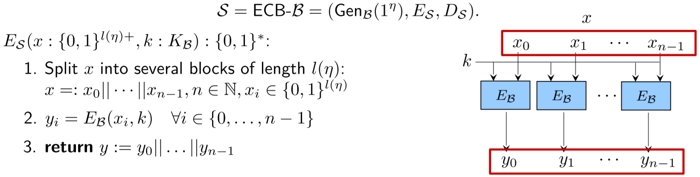
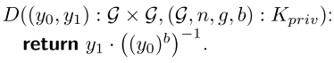

\newpage

# Symmetric encryption

**Kerkhoffs Principle**: The security of a system should only depend on whether the actual key is secret, not on the system itself. The whole system is assumed to be public. No "Security by obscurity".

## Scenario 1

**One message with constant length**

### Cryptosystems

A cryptosystem is a tuple $\mathcal{S} = (X, K, Y, e, d)$ with

- X: set of plaintexts
- K: finite set of keys
- Y: set of ciphertexts
- e: encryption function
- d: decryption function

Perfect correctness: \tab\tab $d(e(x, k), k) \quad \forall x \in X, k \in K$

No unnecessary ciphertexts: \tab $Y = \{e(x,k) | x \in X, k \in K\}$ 


### Vernam system

The Vernam cryptosystem of length $l$ is defined as $(\{0, 1\}^l, \{0, 1\}^l, \{0, 1\}^l, e, d)$ where 

$e(x, k) = x \oplus k$ and $d(y, k) = y \oplus k$.

A vernam system of length $l>0$ provides perfect secrecy for every uniform $P_K$. It is the perfect system for Scenario 1.

### Perfect Secrecy

A cryptosystem with key distribution $\mathcal{V} = \mathcal{S}[P_k]$  provides perfect secrecy if for all plaintext distributions $P_X$, the probability of every plaintext remains the same after the ciphertext is seen, i.e.: $$P(x) = P(x | y) \quad \forall x \in X, y \in Y, P(y) > 0$$

**Example Proof**:

We need to show the criteria above for all plaintext distributions $P_X$. Therefore we use variable probabilities for the plaintexts $P_X(a) = p, P_X(b) = 1-p$ (for 2 plaintexts, else $p_1, ..., p_n$).

\colBegin{.35}

{ width=100% }

\colEnd\hfill\colBegin{.63}

\begin{align*}
    P(a | A) &= \frac{P(a, A)}{P(A)} &= \frac{\frac{1}{2} * p}{\frac{1}{2} * p + \frac{1}{2} * (1-p)} &= p = P(a)\\
    P(a | B) &= \frac{P(a, B)}{P(B)} &= \frac{\frac{1}{2} * p}{\frac{1}{2} * p + \frac{1}{2} * (1-p)} &= p = P(a)\\
    P(b | A) &= \frac{P(b, A)}{P(A)} &= \frac{\frac{1}{2} * (1-p)}{\frac{1}{2} * (1-p) + \frac{1}{2} * p} &= 1-p = P(b)\\
    P(b | B) &= \frac{P(b, B)}{P(B)} &= \frac{\frac{1}{2} * (1-p)}{\frac{1}{2} * (1-p) + \frac{1}{2} * p} &= 1-p = P(b)
\end{align*}

\colEnd
\newline

**Theorem**: 

Let $\mathcal{S} = (X,K,Y,e,d)$ be a cryptosystem providing perfect secrecy, then it holds $|K| \geq |Y| \geq |X|$.

**Shannons Theorem**:

Let $\mathcal{V} = \mathcal{S}[P_k]$ be a cryptosystem with key distribution $P_K$ and $|K| = |Y| = |X|$. The system provides perfect secrecy if and only if

1. $P_K$ is a uniform distribution
2. $\forall x \in X, y \in Y \exists k \in K \text{ with } e(x, k) = y$ (There must be a key for every plaintext/ciphertext pair)

## Scenario 2 

**Multiple messages with constant length, no repetition**

### Vernam in Scenario 2

Vernam is not a secure cryptosystem anymore, since from 2 ciphertexts, Eve can learn non-trivial information about the plaintexts:
$$y_0 \oplus y_1 = x_0 \oplus k \oplus x_1 \oplus k = x_0 \oplus x_1$$

Also with 1 plaintext-ciphertext pair, the key can be calculated as $k = x \oplus y$.

### Substitution Cryptosystem

Let $X$ be a non-empty finite set. A substitution cryptosystem over X is a tuple $(X, \mathcal{P}_X, X, e, d)$ where $\mathcal{P}_X$ is the set of all permutations of $X$.
$$e(x, \pi) = \pi(x) \quad d(y, \pi) = \pi^{-1}(y) \quad \forall x,y \in X, \pi \in \mathcal{P}_X$$

Substitution cryptosystems provide "perfect security" in scenario 2, but they are impractical because the substitution table ($\pi$) has a size of $2^l * l$.

### $l$-Block Cipher

Let $l : \mathbb{N} \rightarrow \mathbb{N}$ be a polynomial. An $l$-block cipher $B$ is a cryptosystem of the form 

$\bigg(\{0,1\}^{l(\eta)}_{\eta \in \mathbb{N}},\; Gen(1^\eta),\; \{0,1\}^{l(\eta)}_{\eta \in \mathbb{N}},\; E,\; D \bigg)$ or simplified: $\bigg(\{0,1\}^l,\; Gen(1^\eta),\; \{0,1\}^l,\; E,\; D \bigg)$


### Substitution-Permutation Cryptosystem (SPCS)

**Notation**: 

- plaintexts are split into $m$ words with length $n$ with $l = m*n$, $x^{(i)}$ denotes the $i$'th word
- $[r] = \{0, 1, ..., r-1\}$
- $\beta \in \mathcal{P}_{[l]}$, then $x^\beta(i) = x(\beta(i))$

**General Principle**: Over $r$ rounds, (round) key additions, word substitutions and bit permutations are applied, including an initial step that just applies key addition and a shortened last round without bit permutation.

\colBegin{.6}

{ width=100% }

\colEnd\hfill\colBegin{.35}

{ width=100% }

\colEnd

**Importance of S-Box**:

Without the S-Box the SPCS is a linear sequence of key additions and since the permutation table is known it is possible to generate a surrogate key based on a known plaintext/ciphertext pair. This is because the system without the S-Box is basically the same as permutating some of the round keys beforehand and then encrypting the plaintext with it. This would result in the same insecurity a Vernam system provides in this scenario.

**Importance of bit permutation**:

Without the bit permutation the words of the plaintext are encrypted independently of each other and an adversary is able to construct two plaintexts with equal words at the end. Since this reveals some non-trivial information to the adversary, by leaking information of some words of the plaintext, the system would be insecure. The advantage of the adversary is given by $adv(U,B) = succ(U, B) - fail(U, B) = 1 - \frac{1}{2^n}$.

**Linear Cryptanalysis**:

- Relies on a set $T$ of plaintext-ciphertext pairs
- Instead of brute forcing the whole key, get small parts of the key at a time
- Exploit linear dependencies
    - This can be found through the orientation
    - The goal is to gather the best orientation by going through every step
    - The parts are Parallel composition, Bit permutation, Key addition, Sequential composition

**AES (Advanced encryption standard)**: basically SPCS with modifications

### Algorithmic Security of Block Ciphers

\colBegin{.55}

We consider a block cipher secure if it is almost as good as a substitution cryptosystem w.r.t. resource-bound adversaries.
Therefore no adversary $U$ should be able to distinguish BCS and SCS. Formally, we use the BCS for $b=1$ (real world) and the SCS for $b=0$ (random world) in the security game.

The winning probability is $Pr[\mathbb{E}(1^n) = 1]$. Since a random guesser already has a probability of $0.5$, the advantage is normalized.

\colEnd\hfill\colBegin{.4}

{ width=100% }

\colEnd

\begin{align*}
    Adv_{U, B}(\eta) &= 2 * \bigg( Pr[\mathbb{E}_U^B(1^\eta) = 1] - \frac{1}{2} \bigg) \in [-1, 1]
    &suc_{U, B}(\eta) = Pr[\mathbb{S}_U^B\langle b=1\rangle (1^\eta) = 1]\\
    Adv_{U, B}(\eta) &= suc_{U, B}(\eta) - fail_{U, B}(\eta)
    &fail_{U, B}(\eta) = Pr[\mathbb{S}_U^B\langle b=0\rangle (1^\eta) = 1]  
\end{align*}

### PRP/PRF Switching Lemma

Since substitution cryptosystems cannot be distinguished from (secure) $l$-Block cryptosystems, we can see $l$-Block cryptosystems as pseudo-random permutations (PRP). Anyway, for proving purposes, it can be easier to see them as pseudo-random functions. The PRP/PRF Switching Lemma says, that we can use them interchangeably, since the difference of advantages is negligible:

Let $B$ be an $l$-block cipher and $U$ be an $l$-distinguisher with runtime bound $q(\eta)$ where q is a positive polynomial and $\eta \in 	\mathbb{N}$.
Then the following holds true:
$$|Adv^{PRP}_{U,B}(\eta) - Adv^{PRF}_{U,B}(\eta)| \leq \frac{q(\eta)^2}{2^{l(\eta)+1}}$$

## Scenario 3

**Arbitrary messages with any length (possibly with repetition)**

### Symmetric Encryption Scheme

A symmetric encryption scheme is a tuple $S = (Gen(1^\eta), E, D)$ with 

- security parameter $\eta$
- ppt key generation algorithm $Gen(1^\eta)$
- ppt encryption algorithm $E(x: \{0, 1\}^*, k: K) : \{0,1\}^*$ 
- dpt decryption algorithm $D(y: \{0,1\}^*, k: K) : \{0,1\}^*$
- and $D(E(x, k), k) = x$

$E$ cannot be deterministic, because else we wouldn't be able to send the same message multiple times, i.e. the same plaintext encrypted under the same key should result in a different ciphertext (with a high probability).

### Encryption Schemes from Stream Ciphers

**Idea**: Vernam is safe if we use every key just once. So using the key as seed of a random number generator, that generates a stream of random numbers, enables the usage of the vernam system for arbitrarily long messages.

#### Number generator

A number generator (NG) is a dpt algorithm of the Form $G(s: \{0,1\}^\eta) : \{0,1\}^{p(\eta)}$ where $p$ is the expansion factor.

### PRNG-Distinguisher

Defined like this:
$U (1^\eta, x : \{1^\eta\}^{p(\eta)}):\{0,1\}$

\colBegin{.4}

{ width=100% }

\colEnd\hfill\colBegin{.5}

With an advantage of:
\begin{align*}
    Adv_{U,G}(\eta) &= 2\cdot (Pr[\mathbb{E}_{U,G}^{PRNG}(1^\eta)=1]-\frac{1}{2})\\
    suc_{U,G}(\eta) &= Pr[\mathbb{S}_{U,G}^{PRNG}\langle b=1\rangle(1^\eta)=1]\\
    fail_{U,G}(\eta) &= Pr[\mathbb{S}_{U,G}^{PRNG}\langle b=0\rangle(1^\eta)=1]\\
    Adv_{U,G}(\eta) &= suc_{U,G}(\eta) - fail_{U,G}(\eta)\\
\end{align*}

\colEnd
### Encryption Schemes from Block Ciphers

#### ECB Mode

**Idea**: Split the message in blocks of constant length and encrypt each block under the given key using the underlying block cipher.

{ width=100% }

**Security**: It's not secure, since the ciphertext carries non-trivial information about the plaintext: $\text{for } y = y_0 || y_1\text{, then } y_0 = y_1 \text{ if } x_0 = x_1$.

#### CBC Mode

\colBegin{.55}

**Idea**: Add and initialization vector $v$ that is \texttt{xor}'ed with the plaintext before encrypting. That $v$ is part of the key. 
\newline\newline
**Problem**: Still deterministic, so every plaintext can be sent just once.

\colEnd\hfill\colBegin{.4}

{ width=100% }

\colEnd

#### R-CBC Mode

\colBegin{.55}

**Idea**: To solve the issues of CBC-Mode, R-CBC moves the initialization vector $v$ out of the key and generates a random one while decryption. The vector is appended as first block of the ciphertext to enable decryption.
\newline\newline
**Security**: Its secure if the underlying block cipher is secure.

\colEnd\hfill\colBegin{.4}

{ width=100% }

\colEnd

#### R-CTR Mode

\colBegin{.55}

**Idea**: Alternative to R-CBC. Generate a random number $r$ (comparable to $v$ of R-CBC), encrypt this random number under the key and xor it with the plaintext. The counter is increased by 1 for each block. The counter $r$ is appended as first block of $y$ to enable decryption.
\newline\newline
**Security**: Its secure if the underlying block cipher is secure.

\colEnd\hfill\colBegin{.4}

{ width=100% }

\colEnd

### CPA-Security

\colBegin{.62}

**CPA**: Chosen-Plaintext-Attack
\newline\newline
**Game**: Adversary $A$ consists of finder $AF$ and guesser $AG$. The finder chooses 2 plaintexts $z_0, z_1$. One of them is encrypted. The guesser has to determine which of them is the corresponding plaintext.
\newline\newline
Advantage, success and failure are defined as for block ciphers.

\colEnd\hfill\colBegin{.35}

{ width=100% }

\colEnd


### CCA-Security

\colBegin{.62}

**CCA**: Chosen-Ciphertext-Attack
\newline\newline
**Game**: In addition to the encryption oracle $H$ from the CPA-game, the adversary also gets a decryption oracle $H^{-1}$.
\newline\newline
Advantage, success and failure are defined as for block ciphers.

\colEnd\hfill\colBegin{.35}

{ width=100% }

\colEnd

### Vaudenay's Padding Attack

**Preconditions**

- The Vaudenay's attack is based on the fact, that the adversary might have a padding oracle
- This padding oracle gives him information if the set padding is correct or not
- In reality this can be a server error, delayed answer from server or any feedback from the decryption algorithm.
- For this attack the encryption algorithm has blocks of length 16 bytes and the last bytes are always the padding to fill up the last block
- Therefore, the padding bytes all represent the number of bytes needed to fill the last block [1, 16]

**The attack**

The attack iterates over the numbers 2 - 16 and tries to pad the ciphertext with the padding based on the numbers. Thereby, it is possible to gather the set padding of the ciphertext and eliminate it right away. Now we get the ciphertext without the padding and can try to gather the plaintext. Therefore, the attacker again iterates over the numbers 1 - 16 in order to get the plaintext byte of the last byte. This process can now be repeated by the attacker for every block and byte in order to gather the whole plaintext.

# Number Theory

## Fundamental Theorem of Arithmetic

Every natural number $n \in \mathbb{N}, n \geq 2$ has exactly one combination of prime factors.
$$n = p_1 \cdot \dots \cdot p_k \quad \text{with} k \leq log(n)$$ 

## Modulo

Let $n \in \mathbb{N}\backslash \{0\}, a \in \mathbb{Z}$. Then $\exists !q \in \mathbb{Z}, r \in \{0, \dots, n-1\}$ such that $a = n*q + r$.
$$a \text{ div } n := q  \quad\quad\text{and}\quad\quad a \text{ mod } n := r$$

## $\mathbb{Z}_n$

Let $n \geq 1$. We define the set $\mathbb{Z}_n := \{0, \dots, n-1\}$ of remainders of divisions by $n$. Let $a,b \in \mathbb{Z}_n$, then 
$$a +_n b := (a + b) \text{ mod } n \quad\quad\text{and}\quad\quad a \cdot_n b := (a \cdot b) \text{ mod } n$$

## Group

A tuple $(\mathcal{G}, \cdot)$ is called group if $\mathcal{G}$ is a non-empty set and $\cdot : \mathcal{G} \times \mathcal{G} \rightarrow \mathcal{G}$ is a function such that: 

- $(x \cdot y) \cdot z = x \cdot (y \cdot z) \quad\forall x,y,z \in \mathcal{G}$ \tab\tab (associativity)
- $\exists e \in \mathcal{G} : e \cdot x = x \cdot e = x \quad \forall x \in \mathcal{G}$ \tab\tab (neutral element)
- $\forall x \in \mathcal{G} \exists x^{-1} \in \mathcal{G} : x \cdot x^{-1} = e$ \tab\tab (inverse element)

The *order* of a group is the number of elements in $\mathcal{G}$.

The exponentiation is defined as usual. For a finite group $(\mathcal{G}, \cdot)$ with order $n$ and neutral element $e$, the following holds true:
$$ g^n = e \quad\quad\text{and}\quad\quad g^a = g^{a \text{ mod } n}$$

## Ring

A Ring is the tuple $(\mathcal{R}, +, \cdot)$ if  $(\mathcal{R}, +)$ is an abelian (commutative) group and the function $\cdot : \mathcal{R} \times \mathcal{R} \rightarrow \mathcal{R}$ is associative, distributive and has a neutral element.

The set of invertible elements in $\mathcal{R}$ is denoted by $\mathcal{R}^*$. The tuple $(\mathcal{R}^*, \cdot)$ is an abelian group called group of units.

## Greatest common divisor

We say $a \text{ divides } b$ or $a | b$ if $\exists c \in \mathbb{Z} : b = c \cdot a$. The greatest common divisor is definded as $$gcd(a, b) = max\{c : c | a \text{ and } c | b\} \text{ where } gcd(0,0) := 0$$

The set of invertible elements of $\mathbb{Z}_n$ can be determined by the gcd.
$$\mathbb{Z}_n^* = \{a \in \mathbb{Z}_n | gcd(a, n) = 1\}$$

## Eurler's Totient Function

Let $n \geq 2$. The Euler's totient function is defined by $$\Phi(n) = | \mathbb{Z}_n^* | = (p_0 - 1) \cdot p_0^{\alpha_0 - 1} \dots (p_{r-1} - 1) \cdot p_{r-1}^{\alpha_{r-1} - 1}$$ where $p_1, \dots, p_{r-1}$ are primes and $n = p_0^{\alpha_0} \dots p_{r-1}^{\alpha_{r-1}}$. Let $p$ be a prime, then $\Phi(p) = p - 1$.

It can also be used to calculate the number of generators in a cyclic group as $\Phi(n) \text{ where } n = |\mathcal{G}|$.

## Euclids Algorithm

Algorithm to calculate the gcd. Can be extended to calculate the inverse of an element in $\mathbb{Z}_n^*$.

\colBegin{.65}

{ width=100% }

\colEnd\hfill\colBegin{.3}

```python
def gcd(a,b):
    while b != 0:
        a, b = b, a % b
    return a
```  

\colEnd

## Fast Exponentiation

\colBegin{.7}

Algorithm to efficiently compute the exponentiation of a group element. Let $\mathcal{G}$ be a group and $g \in \mathcal{G}, m \in \mathbb{N}$. It uses the fact, that $g^{2k} = (g^k)^2$. Instead of doing $2k$ multiplications, we can do $k + 1$. This is applied recursively to minimize the number of exponentiations that need to be computed. To make the algorithm work with any $k$ (not just powers of $2$), we use the binary representation of the exponent, e.g.
$$13 = 2^0 + 2^2 + 2^3 = (1101)_2 \quad \Rightarrow \quad g^{13} = g^{2^0} \cdot g^{2^2} \cdot g^{2^3}$$

To compute $g^m$, the algorithm iterates over the bits of $m$. If the bit is one, multiply the result with the current factor. In any case, square the current factor.

The algorithm has a complexity of $\mathcal{O}(log(m))$.

\colEnd\hfill\colBegin{.25}

{ width=100% }

\colEnd

## Cyclic Groups

A group $\mathcal{G}$ is called cyclic, iff $\exists g \in \mathcal{G}$ such that  $\langle g\rangle = \mathcal{G}$.

If $p = |\mathcal{G}|$ is prime, then $\mathcal{G}$ is a cyclic group.

$\mathbb{Z}_p^*$ is a cyclic group if $p$ is prime.

### Subgroups

Let $(\mathcal{G}, \cdot)$ be a finite group and $U \subseteq \mathcal{G}$. 

**Definition**: The tuple $(U, \cdot)$ is a subgroup of $\mathcal{G}$ iff $U$ is a group.

**Lemma**:  The tuple $(U, \cdot)$ is a subgroup of $\mathcal{G}$ iff $1 \in U$ and $a \cdot b \in U \quad \forall a,b \in U$

**Lagranges Theorem**: If $U$ is a subgroup of $\mathcal{G}$, then it holds true that $|U|\;|\;|\mathcal{G}|$.

### Generated Groups and Generators

Let $\mathcal{G}$ be a group and $g \in \mathcal{G}$. By $\langle g\rangle$ we denote the smallest subgroup of $\mathcal{G}$ that contains $g$. 
$$\langle g\rangle = \{1, g, g^{-1}, g^{2}, g^{-2}, \dots\}\quad
\text{ and if $\mathcal{G}$ if inite: }
\langle g\rangle = \{1, g, g^{2}, \dots, g^{|\langle g\rangle| - 1}\}$$
We call $g$ a generator of $\mathcal{G}$ if $\langle g\rangle = \mathcal{G}$. 

### Finding Generators

We find generators for a group by guessing a group element and checking whether or not it is a generator. This can be evaluated by the equation 
$$g^{n/p} \neq 1 \quad \forall \quad p \in P \text{ (prime factors of $n$) and } n = |\mathcal{G}|$$


\colBegin{.4}

{ width=100% }

\colEnd\hfill\colBegin{.6}

{ width=100% }

\colEnd

This only works, because the probability of finding a generator when randomly sampling is relatively high, concretely it is upper-bounded by $Pr[\langle X_g \rangle = \mathcal{G}] \geq \frac{1}{1+log(n)} \text{ with } X_g \sample \mathcal{G}$.


### Quadratic Residues

A number $a \in \mathbb{Z}_n^*$ *quadratic residue modulo $n$* iff there exists $b \in \mathbb{Z}_n$ such that $b^2 \text{ mod } n = a \text{ mod } n$. $b$ is called root of $a$. All quadratic residues modulo n are denoted by $QR(n)$ and all elements that are *quadratic nonresidue modulo n* $QNR(n)$ with $\mathbb{Z}_n^* = QR(n) \cup QNR(n)$. For prime $p$, both sets have the same order:
$$|QR(p)| = |QNR(p)| = \frac{p-1}{2}$$

### Eulers criterion

Let $p > 2$ be a prime number, $a \in \mathbb{Z}$ and $e = a^{(p-1)/2} \text{ mod } p$ 

1. $e \in \{0, 1, p-1\}$
2. $a \text{ mod } p = 0 \Leftrightarrow e = 0$
3. $a \text{ mod } p \in QR(p) \Leftrightarrow e = 1$
4. $a \text{ mod } p \in QNR(p) \Leftrightarrow e = -1 \text{ mod } p$

We also call the criterion *Legendre symbol of $a$ and $p$* $L_p(a) = a^{(p-1)/2}$.

# Asymmetric Encryption

Symmetric encryption is efficient, but requires a key exchange that makes it impractical for most usecases. Asymmetric encryption works without key exchange, be splitting the key in public and private.

## Asymmetric Encryption Scheme

As with symmetric encryption, the scheme is a tuple $\mathcal{S} = (X, Gen(1^\eta), E, D)$. The key gen algorithm now outputs a tuple $(k, \hat{k})$ (public, private), the encryption $E$ uses the public key $k$ and decrpytion $D$ the private key $\hat{k}$.

## Asymmetric CPA-Security

\colBegin{.65}

The security game is defined analogously to symmetric encryption. The key is now a tuple and the adversary knows the public key. Advantage, success and failure are defined as for Block Ciphers.

\colEnd\hfill\colBegin{.3}

{ width=100% }

\colEnd

## RSA

RSA is an asymmetric encryption scheme $\mathcal{S}_{RSA} = (X, Gen(1^\eta), E, D)$. It uses the problem of computing prime factors as oneway function. 

- The keygen algorithm randomly selects 2 different primes $p$ and $q$ of binary length $\eta$. 
\begin{align*}
&n = p \cdot q\quad\quad\quad\quad\quad\quad
m = (p-1) \cdot (q-1) = \Phi(n)\\
&e \sample \mathbb{Z}_m^* \quad\quad\quad
d = e^{-1} \mod m\quad\quad\quad
k = ((n,e), (n,d))
\end{align*}
- $E(x, (n,e)) = x^e \mod n$
- $D(y, (n,d)) = y^d \mod n$


\colBegin{.55}
It has not been proven, that the RSA encryption cannot be inverted. An algorithm that attempts that is called inverter $I$. The advantage is assumed to be negligible, which is called RSA-Assumption.

$|Adv^{RSA}_{I,S}(\eta)| = Pr[\mathbb{E}^{RSA}_{I,S}(1^\eta) = 1]$

\colEnd\hfill\colBegin{.3}

{ width=100% }

\colEnd


Since the encryption function is deterministic, this textbook RSA is not secure. The scheme can be modified to be secure, by adding randomness. E.g. PKCS#1 v1.5 defines a random padding that fixes that issue: $$0^{14} || 10 || r || 0^8 || x$$

While this is assumed to be sufficient for CPA-Security, RSA does not hold CCA-Security. In fact one doesn't even need a full decryption oracle as demonstrated in the Bleichenbacher Attack. 

## ElGamal

The ElGamal is an asymmetric encryption scheme that builds on the fact that it is hard to get $g^{ab}$ from $g^a$ and $g^b$, but easy to get from either $g^a$ and $b$ or $g^b$ and $a$.

- The keygen algorithm randomly selects a $b \in \{0, \dots, n-1\}$, where $(\mathcal{G}, n, g)$ is the output of the GroupGen algorithm. The output is the public key $(\mathcal{G}, n, g, g^b)$ and the private key $(\mathcal{G}, n, g, b)$. In a real scenario this represents the keypair of the receiving person.
- The encryption function obtains another private key $a$ randomly and calculates the public key $g^a$. In practice, this is the senders keypair. $E$ encrypts the plaintext $x$ by calculating $x \cdot (g^b)^a$
- The decryption function takes the senders public key, exponentiates it with the receivers private key and inverts the result to obtain $((g^a)^b)^{-1}$. This can be used to calculate the plaintext as $y \cdot ((g^a)^b)^{-1} = x \cdot (g^b)^a \cdot ((g^a)^b)^{-1} = x$.

Formally:

\colBegin{.4}

\centering
{ width=70% }

\colEnd\hfill\colBegin{.55}

\centering
{ width=70% }

\colEnd

# Hashes

Secure encryption schemes provide confidentiality, but no integrity. Among other things, this is what MACs and Signature Schemes aim for in the symmetric and asymmetric case respectively.

## Cryptographic Hash Function and Compression Function Definition

Let $\eta \in \mathbb{N}$, $l: \mathbb{N} \rightarrow \mathbb{N}$. A Cryptographic Hash function is a tuple $\mathcal{H} = (Gen(1^\eta), h)$ with a key generation algorithm and a (ppt) hash algorithm $$h(k: K, x: \{0,1\}^*) : \{0,1\}^{l(\eta)}$$.
We call this hash function Compression Function if $h$ is only defined for inputs $x \in \{0,1\}^{l'(\eta)}$ with $l'(\eta) > l(\eta)$.

## Security of Hash Functions

Hash Functions can fulfill different security notions. 

- Collision resistance: No adversary can find 2 different strings with the same hash value.
- Target-collision resistance: Given a string, no adversary can find a second string with the same hash value.
- Preimage resistance: Given a hash value, no adversary can find a string with the same hash value.

\colBegin{.55}

For cryptographic hash functions one usually aims for collision resistance. Note that unlike encryption functions hash functions normally use a public key. Therefore a collision finder is a ppt algorithm \newline$A(1^\eta, k: K) : \{0,1\}^* \times \{0,1\}^*$. The security game does not have a shortened version and the advantage is not normalized $Adv_{A, \mathbb{H}}^{Coll} = Pr[\mathbb{E}^{Coll}_{A, \mathbb{H}}(1^\eta) = 1]$.

\colEnd\hfill\colBegin{.4}

{ width=100% }

\colEnd

## Merkle Damgard Transform

Instead of defining a hash function directly on arbitrary input values, it is easier to design a collision resistant compression function $h'(k: K, x: \{0,1\}^{2\eta}) : \{0,1\}^\eta$. The Merkle Damgard transform pads the input and applies the compression function recursively. The resulting hash function is collision resistant if the underlying compression function is collision resistant.

# MACs
## Message Authentication Code (MAC) Definition

A MAC is the tuple $\mathcal{M} = (Gen(1^\eta), T, V)$ with 

- key generation algorithm $Gen(1^\eta)$
- tag generation algorithm $T(x: \{0,1\}^*, k: K) : \{0,1\}^{l(\eta)}$
- verification algorithm $V(x \in \{0,1\}^*, t \in \{0,1\}^{l(\eta)}, k: K) : \{valid, unvalid\}$

such that $\forall x \in X, k \in K : V(x, T(x,k), k) = valid$

## MAC security

\colBegin{.55}

A MAC is considered unforgeable if an adversary cannot compute a valid message-tag pair without knowing the key, even provided an oracle. The advantage is not normalized $Adv_{A, \mathcal{M}}^{MAC}(\eta) = Pr[\mathbb{E}_{A, \mathcal{M}}^{MAC}(1^\eta) = 1]$.

\colEnd\hfill\colBegin{.3}

\centering
{ width=100% }

\colEnd

## MAC construction

### MAC from Blockcipher 

Let $\mathcal{B} = (\{0,1\}^{l(\eta)}, Gen(1^\eta), \{0,1\}^{l(\eta)}, E, D)$ be a blockcipher. Then $\mathcal{M}_\mathcal{B} = (Gen(1^\eta), T, V)$ is a MAC with $T(x, k) = E(x, k)$. It is unforgeable if the underlying block cipher is secure, but it works only for inputs of length $l(\eta)$, because $((x_1 || x_2), (F(x_1) || F(x_2)))$ is a valid message-tag pair.

To apply the principle to messages of length multiple of $l$, one can use the CBC scheme known from symmetric encryption. Then the MAC is unforgeable if the block cipher is secure and it is only used on messages of the same length. To overcome this limitation, one can use different modifications. One possibility is to apply CBC-MAC to the tag a second time.

### Hash-and-MAC

First hash the plaintext to obtain a message of constant length and then MAC the result. Let $\eta \in \mathbb{N}$, $\mathcal{H} = (Gen(1^\eta), h)$ be a hash function and $\mathcal{M} = (Gen_\mathcal{M}(1^\eta), T)$ be a MAC. Then $$HashMAC[\mathcal{H}, \mathcal{M}] = (Gen_{\mathcal{H}, \mathcal{M}}, T') \text{    with    } T'(x, (k_\mathcal{H}, k_\mathcal{M})) = T(h_{k_\mathcal{H}}(x), k_\mathcal{M})$$ The scheme is secure if $\mathcal{H}$ is collision resistant and $\mathcal{M}$ is a secure MAC.


### HMAC

HMAC constructs a MAC using only hash functions and no encryption. First, the algorithm creates an inner and an outer key by XOR'ing the (padded) key with a special constant respectively. The plaintext and the inner key are then concatenated and hashed. The result is concatenated with the outer key and hashed again. $$t = h(k_o || h(k_i || x))$$


## Authenticated Encryption and CCA-secure symmetric encryption

Combining confidentiality and integrity is an important requirement for real-world applications. It can be accomplished trough authenticated encryption schemes, that imply CCA-Security. 

**Insecure approaches**:

- Encrypt-and-MAC: Sending the ciphertext and the tag (in plaintext) is not secure, since MACs don't provide confidentiality and an adversary might get information about the plaintext.
- MAC-then-Encrypt: Encrypting the concatenation of the plaintext and the tag is not secure either, since the MAC only protects the integrity of the plaintext, not the ciphertext. Therefore padding attacks are still possible.

**Encrypt-then-MAC**:

- First encrypt, then tag the ciphertext. Send both ciphertext and tag
- Is secure if the encryption scheme and the MAC are (CPA) secure
- CCA-security: Attackers cannot use the decryption oracle, because he doesn't know $k_\mathcal{M}$ and therefore cannot create generate valid ciphertexts.

**Special constructions**:

One can also create special constructions that provide authenticated encryption directly. An example is the GCM mode for block ciphers, which is used in TLS.


# Signatures
## Digital Signature Scheme Definition

A digital signature scheme is a tuple of the form $\mathcal{S} = (X, Gen(1^\eta), T, V)$ with 

- ppt key generation algorithm that outputs a public-private-key pair $(k, \hat{k})$.
- domain $X = (X_k)_{k \in K_{pub}}$
- tagging algorithm $T(x: X_k, \hat{k}: K_{priv}): \{0,1\}^{l(\eta)}$
- verification algorithm $V(x: X_k, s \in \{0,1\}^{l(\eta)}, k: K_{pub}) : \{valid, unvalid\}$

such that $\forall (k, \hat{k}) \in K, x \in X_k : V(x, T(x, \hat{k}), k) = valid$

## Digital Signature Security

\colBegin{.6}

A signature scheme is called secure, if no adversary can compute a valid message-tag pair provided the public key and a signing oracle. There is no shortened game and the advantage is not normalized: $Adv_{A, \mathcal{S}}^{Sig} = Pr[\mathbb{E}^{Sig}_{A, \mathcal{S}}(1^\eta) = 1]$.

\colEnd\hfill\colBegin{.35}


\colEnd

## Hash-and-Sign

Let $n in \mathbb{N}, \mathcal{H} = (Gen_\mathcal{H}(1^\eta), h)$ be a hash function and $\mathcal{S} = (X, Gen_\mathcal{S}(1^\eta), T, V)$ be a signature scheme. Then $HashSign[\mathcal{H}, \mathcal{S}] = (X, Gen_{\mathcal{S}, \mathcal{H}}(1^\eta), T', V')$ with 

\colBegin{.3}

{ width=100% }

\colEnd\hfill\colBegin{.27}

{ width=100% }

\colEnd\hfill\colBegin{.33}

{ width=100% }

\colEnd

It is secure if it is based on a secure hash and a secure signature scheme. Anyway one needs a secure signature scheme to construct Hash-and-Sign schemes. Also the resulting schemes are often impractical.

## Random Oracle

A random oracle returns a random value of fixed length for messages and caches the results so that the same message leads to the same return value. It can be seen as an ideal hash function with optimal collision resistance. Random oracles are probably impossible to implement, but the assumption enables the construction of efficient cryptosystems like encryption, signature and MAC schemes.

## FDH-RSA

FDH-RSA implements a Hash-and-Sign scheme with a random oracle as hash function and RSA as signature scheme. For RSA, the only difference to encryption is that the private key is used for signing/encrypting and the public key for verification/decryption. In practice one uses a secure hash function like SHA256 instead of the random oracle.

Let $n \in \mathbb{N}$ and $l: \mathbb{N} \rightarrow \mathbb{N}$ be a polynomial and $H^{\{0,1\}^*}_{\mathbb{Z}_n}$ be a random oracle. $FDH-RSA = (X, Gen(1^\eta), T, V)$ with

- $Gen(1^\eta)$ keygen as with RSA
- $X = \{0,1\}^*$
- $T(x, (n,d)) = (H^X_{\mathbb{Z}_n}(x))^d \mod n$
- $V(x, s, (n,e)) = \begin{cases}valid & \text{if } s^e \mod n = H^X_{\mathbb{Z}_n}(x)\\ invalid & \text{else} \end{cases}$

The resulting scheme is secure, even though the RSA signature scheme is not by itself. The security holds under the RSA assumption in the Random Oracle Model (ROM).

